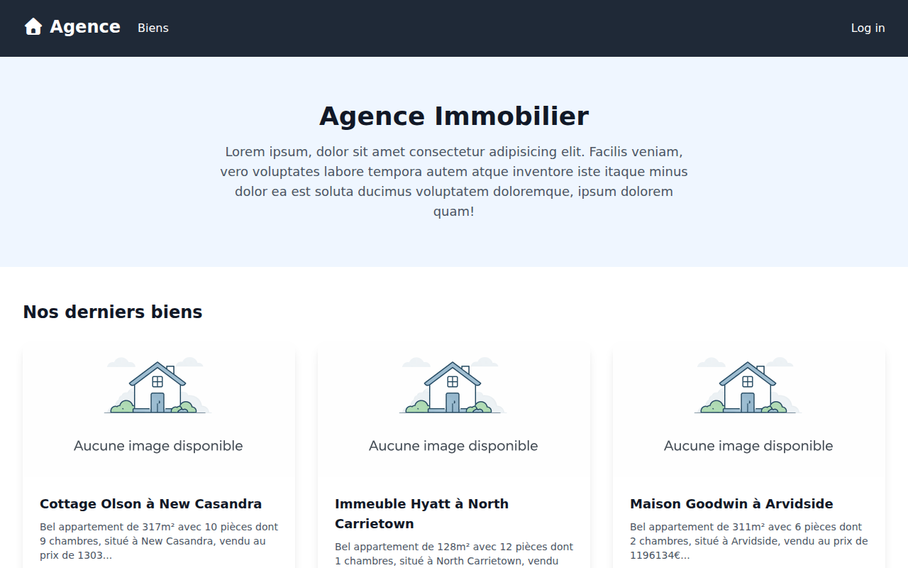
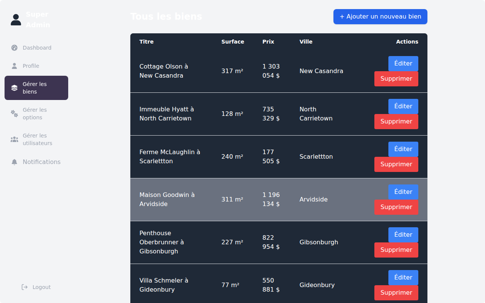

# Agence Immobilier 🏠

A modern real estate management platform built with Laravel 12, featuring a robust administrative panel for property management, user roles, and real-time notifications.

## ✨ Features

- **Property Management**: Create, edit, and delete property listings with ease.
- **Advanced Filtering**: Search for properties based on various criteria (implied by typical real estate apps).
- **User Roles**: Three distinct roles (Super Admin, Owner, Agent) with specific permissions.
- **Notifications**: System for tracking important updates and property-related events.
- **Responsive Design**: Beautifully crafted UI using Tailwind CSS 4, optimized for all devices.
- **Media Support**: Image uploads for property listings.

## 📸 Screenshots

### Homepage


### Administrative Panel


## 🛠 Tech Stack

- **Backend**: [Laravel 12](https://laravel.com)
- **Frontend**: [Tailwind CSS 4](https://tailwindcss.com), [Alpine.js](https://alpinejs.dev)
- **Database**: [SQLite](https://www.sqlite.org)
- **Build Tool**: [Vite](https://vitejs.dev)

## 🚀 Getting Started

Follow these steps to get the project up and running locally.

### Prerequisites

- PHP >= 8.2
- Composer
- Node.js & NPM

### Installation

1. **Clone the repository**
   ```bash
   git clone <repository-url>
   cd agence-immobilier
   ```

2. **Install PHP dependencies**
   ```bash
   composer install
   ```

3. **Install JS dependencies**
   ```bash
   npm install
   ```

4. **Environment setup**
   ```bash
   cp .env.example .env
   php artisan key:generate
   ```

5. **Database setup**
   ```bash
   touch database/database.sqlite
   php artisan migrate --seed
   ```

6. **Build assets**
   ```bash
   npm run build
   ```

7. **Start the server**
   ```bash
   php artisan serve
   ```

## 🔐 Access Credentials

You can use the following accounts to test the different roles (password is `password` for all):

- **Super Admin**: `superadmin@example.com`
- **Owner**: `owner@example.com`
- **Agent**: `agent@example.com`

## 📄 License

The Laravel framework is open-sourced software licensed under the [MIT license](https://opensource.org/licenses/MIT).
