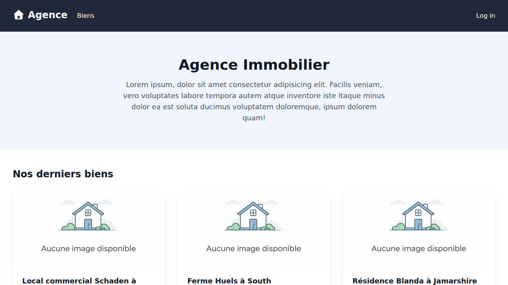
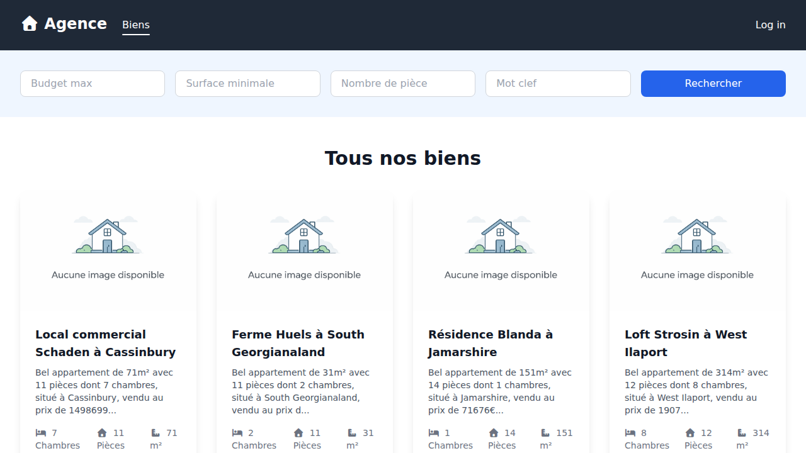

# Agence Immobilier

A modern real estate management platform built with Laravel. This application allows administrators to manage properties, options, and user roles while providing a public interface for users to browse and inquire about available properties.



## Features

- **Property Management**: Full CRUD for real estate listings, including images and detailed specifications.
- **Option Management**: Manage property options (e.g., Garage, Pool, Garden) and associate them with listings.
- **User Roles**: Role-based access control with `superadmin`, `owner`, and `agent` roles.
- **Client Inquiries**: Public property catalog with contact forms for potential buyers.
- **Notifications**: Internal notification system for property requests.
- **Dashboard**: Admin dashboard for overview and quick actions.
- **Profile Management**: Users can update their profile information and manage their account security.

## Tech Stack

- **Backend**: Laravel 12, PHP 8.4+
- **Frontend**: Tailwind CSS 4, Vite, AlpineJS
- **Database**: SQLite (default)
- **Testing**: Pest PHP

## Getting Started

### Prerequisites

- PHP 8.4 or higher
- Composer
- Node.js & NPM

### Installation

1. **Clone the repository**:
   ```bash
   git clone <repository-url>
   cd agence-immobilier
   ```

2. **Install dependencies**:
   ```bash
   composer install
   npm install
   ```

3. **Environment Setup**:
   ```bash
   cp .env.example .env
   php artisan key:generate
   ```

4. **Database Setup**:
   ```bash
   touch database/database.sqlite
   php artisan migrate --seed
   ```

5. **Build Assets**:
   ```bash
   npm run build
   ```

6. **Run the Application**:
   ```bash
   php artisan serve
   ```

### Default Credentials

The `DatabaseSeeder` provides the following test accounts (password: `password`):

- **Super Admin**: `superadmin@example.com`
- **Owner**: `owner@example.com`
- **Agent**: `agent@example.com`

## Testing

Run the test suite using Pest:

```bash
php artisan test
```

## Screenshots

### Property Listings

